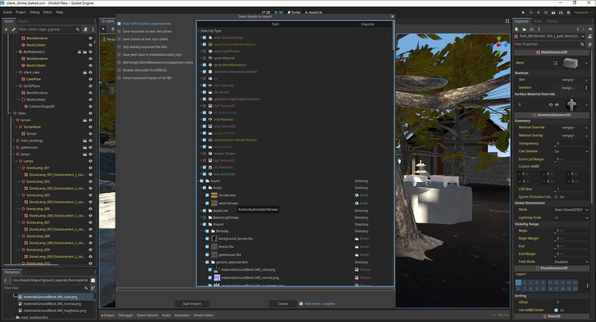

# Unidot Importer

Unify your Godot asset interop with **Unidot**, a **Uni**versal Go**dot** Engine source asset translator and interoperability pipeline for Godot 4.

At its heart, Unidot Importer can convert `.unitypackage` assets and asset folders into Godot 4.x compatible formats.

It takes original **source assets** and *translates* them into Godot native equivalents.
For example, `.unity` and `.prefab` become `.tscn` and `.prefab.tscn`.

FBX Files are currently ported to glTF but this may be made more flexible in the future.

Raw mesh, anim, material assets and more are converted directly to godot `.tres/.res` equivalents.

Due to being a translator, Unidot may safely be removed from the project when completed. (other than `runtime/anim_tree.gd`)

## Quick links

- [Follow updates at https://unidotengine.org/](https://unidotengine.org).
- [Read documentation at https://docs.unidotengine.org/](https://docs.unidotengine.org).
- [Join our community on Discord](https://discord.gg/JzXkxMRd9x) for help, to share success or feedback.

## Made for Godot Engine 4

We rely on automatic FBX to glTF translation during `.unitypackage` import using FBX2glTF. [please download the FBX2glTF exe](https://github.com/godotengine/FBX2glTF/releases) and configure FBX Import in Godot Editor Settings before using Unidot.

Please use a version of Godot 4.0 or later with FBX2glTF configured in Editor Settings to run this addon.

## System requirements:

Unidot has been tested on Windows, macOS and Linux versions. Currently supports Godot Editor versions 4.0 through 4.2.

Unidot recommends a system with at least 16GB of RAM for many assets. It is uncommon for large imports to take more than 10-12GB.

Due to pre-caching of assets in memory, it is okay if some data is swapped to disk with virtual memory, especially in large imports of thousands of files..

## Installation:

1. This repository should be imported at `addons/unidot_importer` in the project, such as using git submodule or unzipping.
   * Note that `runtime/anim_tree.gd` will be referenced by scenes and should be kept even if the rest of unidot is removed.
2. Enable the Unidot Importer plugin in `Project Settings -> Plugins tab -> Unidot`
3. Unidot requires an installation of FBX2glTF from https://github.com/godotengine/FBX2glTF/releases and set in the FBX2glTF.exe path in the Import category of **Editor Settings** (not Project Settings)
4. To add TIFF / .tif and PSD / .psd support, install [ImageMagick](https://imagemagick.org/) or [GraphicsMagick](http://www.graphicsmagick.org/) into your system path or copy convert.exe into this addon directory.
5. Access the importer through `Project -> Tools -> Import .unitypackage...` and select a package or an asset folder

Read more at our [documentation site](https://docs.unidotengine.org).

## Features

- `.unitypackage` importer and translation shim.
- Translates native filetypes (such as .unity or .mat) to Godot native scene or resource types.
- Animation and animation tree porting, including humanoid .anim format.
- Support for humanoid armatures, including from prefabs, unpacked prefabs and model import.
- Translates prefabs and inherited prefabs to native Godot scenes and inherited scenes.
- Supports both binary and text YAML encoding
- Implementation of an asset database by GUID

Note that scripts and shaders will need to be ported by hand. However, it will be possible to map scripts/shaders to Godot equivalents after porting.

## Supported asset types:

* Mesh/MeshFilter/MeshRenderer/SkinnedMeshRenderer
* Material (standard shader only)
* Avatar
* AnimationClip
* AnimatorController (relies on small runtime helper script `unidot_importer/runtime/anim_tree.gd`)
* AnimatorState/AnimatorStateMachine/AnimatorTransitionBase/BlendTree
* PrefabInstance (prefabs)
* GameObject/Transform/Collider/SkinnedMeshRenderer/MeshFilter/Animator/Light/Camera etc. (scenes)
* Texture2D/CubeMap/Texture2DArray etc.
* AssetImporter
* AudioClip/AudioSource
* Collider/Rigidbody
* Terrain (limited support for detail meshes as MultiMeshInstance)
* LightingSettings/PostProcessLayer

## Unsupported

* Shader: a system may someday be added to create mappings of equivalent Godot Engine shaders, but porting must be done by hand.
* MonoBehaviour (C# Script porting)
* AvatarMask (waiting for better Godot engine support)
* Canvas / UI is not implemented.
* PlayableDirector
* Anything not listed above

## Troubleshooting

* If an import fails, it is possible to view the logs of the most recently completed import.
	* Use `Project -> Tools -> Show last import logs`.
	* Click the yellow or red columns to see all errors in the project.
	* Or, click a Logs button on a file to see the entire log.
	* Clicking the Logs for Assets may take time to collect all logs in the project, but can be helpful for submitting a bug report.
	* The Godot console output may also be helpful if submitting a bug report.

* It would be good to double check that all dependencies imported, and then try again.

* If Godot crashes during an import, it may be good to try a smaller import.

* If importing a subset of files, import assets in the correct order: make sure to do materials after textures, and scenes after models / materials they may need.
  Using the shift key while selecting assets can ensure you include the needed depdencies.

* If models in a scene are looking corrupted, it may be due to the scene using unpacked prefabs. In this case, replacing them with the original converted ".gltf" should work.

## Known issues

- There may be large memory consumption in the earlier phases of the import process. Unidot will pre-parse most assets upfront in the "Preprocessing" stage.
  Additionally, Godot may read textures from disk while assigning materials.
- Due to memory constraints, large animation files currently import in the main thread.
	- This could cause Godot to hang or freeze for a long time in animation packs with a message such as "Importing 50 textures, animations and audio...".
- Reimporting animations after import can lose the correct track paths, since the animations are modified during scene import.
- Unidot does not indicate clearly when assets are missing GUID references. Models missing referenced data may not import correctly.
- Models missing UpperChest, Shoulder or Neck bones may animate incorrectly due to lack of missing bone compensation in Godot's Humanoid retargeter.
- Unpacked prefabs of humanoid models may malfunction due to the retargeting.
  Unidot does its best to correct these cases, but some models, especially those with rotated hips and scaled armature, may malfunction.
- non-weight-painted vertices currently go to skeleton origin instead of hips (bone index 0)
- FBX2glTF which is used to convert .fbx to .gltf has some rare bugs. These would currently affect all FBX imports into Godot Engine.
	- Some rare fbx models with ngons may be missing triangles.
	- Models using RotationPivots may not have the meshes centered at the pivot points,
	  which could impact content or animations that expect the correct pivots.
- Shift to select dependencies does not find all texture assets referenced by models.

## Future work

- Repacking unpacked avatar prefabs where possible
- Better support for attaching outfits to imported models.
  For example, if any skinned meshes are humanoid but missing animator or no avatar set,
  treat skeleton hierarchy as having humanoid avatar enabled from that model.
- Reduce the dependency on FBX conversion tools

## A final note:

This tool is designed to assist with importing or translating source assets made for use in the editor. It makes an assumption that (other than animator controllers) most yaml files contain only one object).

Unidot solely translates existing usable source assets into equivalent Godot source assets. There are no plans to add functionality for decompiling asset bundles or ripping game content. That is not the goal of this project.

# Join our community

- [Follow updates at https://unidotengine.org/](https://unidotengine.org).
- [Read documentation at https://docs.unidotengine.org/](https://docs.unidotengine.org).
- [Join our community on Discord](https://discord.gg/JzXkxMRd9x) for help, to share success or feedback.

# Thanks

it is only thanks to all of you in the community using and supporting the project,
and for the many contributors that Unidot released in the form it has today <3

Special Thanks to

* Cthulhoo for some incredibly useful testcases for various humanoid rigs and animations,
  and for their explanation and insight into how Root Motion works that allowed me to implement RM support.
* Stan for sending over some really cool gamejam projects filled with all sorts of different ways to reference prefabs.
* And quite a number of others who provided test assets or testing.
* The [V-Sekai community](https://github.com/V-Sekai) for all your support.
* The [V-Sekai team](https://v-sekai.org) for contributions and inspiration.

